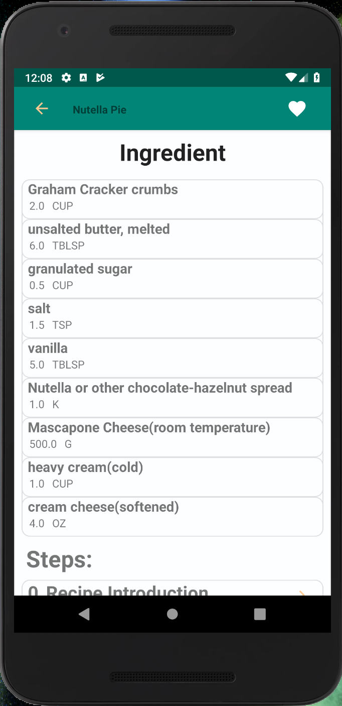

# BakingApp
In this project, I created an app to view video recipes.  I handled media loading, verified user interfaces with UI tests, 
and integrate third party libraries. I also provided a complete user experience with a home screen widget.

##Overall System Development

The interfaces of Baking application are designed by android studio and xml language. 

#### Home page
  

#### Recipe page
  
  
  
#### Step page  
  

